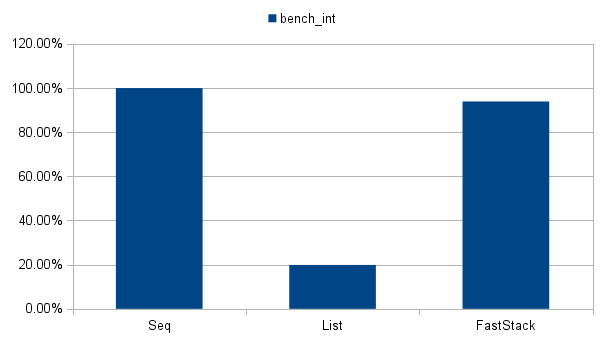
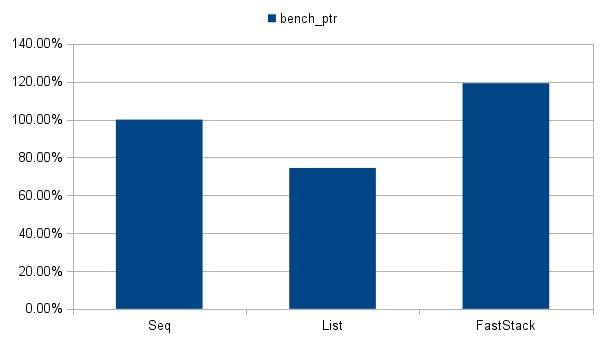

FastStack
=========

FastStack is dynamically resizable data structure optimized for fast iteration over the large arrays of similar elements avoiding memory fragmentation (e.g., update and rendering cycles of a game scene).

Tools
=====

**bench_int** - Benchmark with int elements (low memory fragmentation case).

**bench_ptr** - Benchmark with ptr elements (high memory fragmentation case).

(using [nimbench](https://github.com/ivankoster/nimbench))

**test** - Unit testing suite (using [unittest](http://nim-lang.org/docs/unittest.html))

Benchmark (int)
===============

```nimrod
type
  Elem = ref object of RootObj
    data: int
```

Comparing to seq and DoublyLinkedList on i5-2500K @ 4000MHz:
```
============================================================================
GlobalBenchmark                                 relative  time/iter  iters/s
============================================================================
GlobalBenchmark                                            249.31ps    4.01G
============================================================================
bench_int.nim                                   relative  time/iter  iters/s
============================================================================
Sequence                                                   108.55us    9.21K
List                                                       545.62us    1.83K
FastStack                                                  115.65us    8.65K
```

* Seq: 100.00%
* List: 19.87%
* FastStack: 93.92%



Benchmark (ptr)
===============

```nimrod
type
  Elem = ref object of RootObj
    data: pointer
```

Comparing to seq and DoublyLinkedList on i5-2500K @ 4000MHz:
```
============================================================================
GlobalBenchmark                                 relative  time/iter  iters/s
============================================================================
GlobalBenchmark                                            249.31ps    4.01G
============================================================================
bench_ptr.nim                                   relative  time/iter  iters/s
============================================================================
Sequence                                                     1.65ms   607.54
List                                                         2.21ms   452.28
FastStack                                                    1.38ms   724.24
```

* Seq: 100.00%
* List: 74.44%
* FastStack: 119.21%



